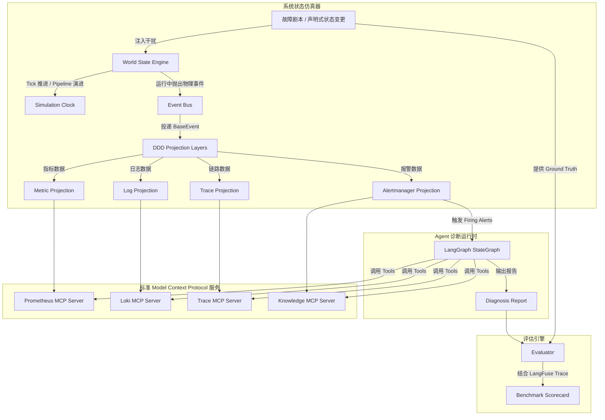

# Diting (谛听)

> **Diting (谛听) 是一个面向 Agent Runtime 的可重复、可评测、可扩展的分布式系统状态仿真与评估平台 (AgentBench ASSEP)。**
> 
> 🐕 **命名渊源**：谛听是中国神话中能“辨听万物、知晓真相”的瑞兽。Diting 平台则通过倾听系统中的时序指标、日志与 Trace 事件，诊断并寻求微服务故障的根本原因 (Root Cause)。
> 
> 本项目不是一个单纯的 AIOps 故障诊断 Demo，而是一个通用的 Agent 系统能力评估基准（Benchmark）。AIOps（故障诊断与可观测性）是本平台支持的首个仿真领域。

---

## 📐 设计原则 (Design Principles)

1. **Deterministic (确定性)**
   引入统一的 `Simulation Clock`（虚拟仿真时钟）和基于故障剧本（Scenario）的 **可控随机种子 (Seed) 隔离机制**。这确保了在模拟复杂环境中的白噪声和偶发警报时，相同的剧本和种子能产生 100% 一致的数据，实现完全的回归可重复性。

2. **Single Source of Truth (单一事实源)**
   以 World State Engine 中的 `Entity` 物理资源状态为唯一事实源。所有的时序指标、日志、Trace 链路和系统告警，均是从该事实源投影（Projection）而来，保证数据之间的物理逻辑绝对一致。

3. **Event-Driven (事件驱动)**
   状态演进中发生的所有物理水位变动、方法调用、超时、OOM 等均产生结构化的 `BaseEvent`，由事件总线分流进行多维投影。

4. **Framework Agnostic (框架无关)**
   模拟器、投影层与 Agent 运行时通过标准 MCP (Model Context Protocol) 协议完全解耦。你可以无缝将当前的 LangGraph 替换为 AgentScope、AutoGen 等，在同一套仿真环境下一较高下。

5. **Evaluation First (评估先行)**
   每个 Scenario 均具备包含排查路径、预期工具、关联 Entity 和根因的细粒度 Ground Truth，实现多维度的自动化 Benchmark 评分。

### 📦 开发与包管理约束
* **包管理器**: 全局采用 **`uv`** 管理 Python 虚拟环境与依赖（`uv venv` 和 `uv pip`）。
* **加速镜像**: 统一指定 **阿里云 PyPI 镜像源**：`https://mirrors.aliyun.com/pypi/simple/`。

---

## 🏗️ 整体架构 (Architecture)



---

## 🧩 核心概念与模块说明

### 1. 仿真实体与拓扑 (Entity & Topology)
系统中的物理组件（微服务、Redis 缓存、数据库、主机节点、网络链路）均被抽象为 `Entity`。
* **物理资源 (Resource State)**：Entity 仅保留底层真实的物理资源状态（如工作线程数、各池连接数、堆内存、磁盘水位等），并显式定义其物理上限行为：
  * **线程耗尽** -> 触发排队溢出直接抛出 **503** 拒绝；
  * **连接池满** -> 获取连接延迟增加直至触发 **Timeout 超时**；
  * **内存写满** -> 频繁 GC 导致 CPU 飙升直至触发 **OOM**；
  * **磁盘写满** -> 触发 **IO 失败**。
* **共享资源等效竞争**：对于多个服务共用同一个物理底座（如 Redis/DB）的争抢场景，采用求和判定逻辑等效代替复杂互斥锁，确保仿真逻辑极简但对 Agent 输出 100% 真实的可观测信号。
* **派生指标 (Derived Metrics)**：所有的 CPU、内存使用率、延迟（Latency）、错误率都是基于当前物理状态通过物理计算公式**衍生**出的，并自带 $\pm 2\%$ 的噪声扰动，保证监控的真实同步与抗噪挑战。
* **拓扑感知**：支持加权拓扑图关系并显式区分调用语义：
  * **Fan-out (并行扇出)**：同时调用所有依赖服务，多为聚合网关层。
  * **Route (路由选择)**：单次 Request 依据权重在路径中随机游走。
  ```python
  topology = {
      "Gateway": {
          "type": "fan_out",
          "dependencies": {"OrderService": 1.0, "UserService": 1.0}
      },
      "OrderService": {
          "type": "route",
          "dependencies": {"PaymentService": 0.8, "InventoryService": 0.2}
      }
  }
  ```

### 2. 仿真时钟与流水线演进 (Simulation Clock & Pipeline)
系统运行不依赖真实睡眠（Real Sleep），而是依赖基于 discrete tick 的 `SimulationClock`。每个 Tick 默认代表 **100ms**（步长可配，支持 50ms, 250ms 等亚秒级粒度），这使我们能完美还原微服务毫秒级重试、超时、连接池抢占和瞬间熔断等瞬态物理行为。

每一个 Tick 依次执行：
`Update Request` -> `Update Queue` -> `Update Resource` -> `Update Dependency` -> `Update Metrics` -> `Generate Events`。
可以在几毫秒内推演完数小时的系统演变，极利于高速 Benchmark 评测。

### 3. DDD 投影层与多进程数据共享 (Projections & State API)
在 discrete simulation 模式下，所有时序指标、日志、Trace 均离线推演并以 `session_id` 绑定存储在共享内存中。
为了支持多进程隔离及 MCP Server（独立进程）与仿真引擎的数据共享，Diting 启动一个轻量级的 **In-Memory State HTTP API Server**，屏蔽了物理磁盘 I/O 和 SQLite 锁冲突。各 MCP Server 均通过标准 HTTP 请求向仿真端拉取数据：
* **Metric Projection**：投影为时序指标，供 Prometheus MCP 查询。
* **Log Projection**：订阅物理事件（如 `RedisPoolExhausted`），渲染为带 `trace_id` 上下文的日志。
* **Trace Projection**：聚合分布式调用的 Span 事件，供 Trace MCP 查询全链路响应分布。
* **Alertmanager Projection**：在指标越线时投影为 `Firing Alert`，在故障消解或系统自愈后投递 `Resolved Alert` 并填入 `endsAt` 时间戳，完整仿真告警生命周期，以支持评估 Agent 在告警中途恢复时的策略变通能力。

### 4. LangGraph Multi-Agent 黑板协同诊断流
使用 LangGraph 状态图构建 **多轮黑板协作（Blackboard Collaboration Loop）** 排查工作流，深度展现状态控制力：
* **排查白板 (Blackboard State)**：State 中维护会话级排查上下文（如 `suspect_entities` 可疑实体、时间范围、轮次）。各 Agent 通过协作黑板进行信息流转。
* **职责隔离与多轮循迹**：
  * **Round 1 (广度首查)**：平行子 Agent (Metrics, Logs, Trace Agent) 仅调用对应领域的 MCP 工具，捞取入口警报的表层指标并追加下层可疑节点至白板。
  * **Round 2 (深度定向)**：子 Agent 观察白板中新放入的可疑节点（如 OrderService），定向深入检索其对应时段的细节日志、重试链路，极具靶向性地节省 Token 并过滤白噪声。
* **Wiki RAG 降噪定位**：`Knowledge Agent` 基于关键词去混杂了 **90% 干扰运维Wiki** 的知识库中进行降噪检索，匹配并筛选正确的故障 Runbook。
* **决策网关与推导**：`Correlation / Diagnosis Agent` 充当决策门，自动评估白板数据是否闭环，流向最终的根因结构化推导与 HTML 报告输出。

### 5. 混合评估引擎 (Hybrid Evaluator)
不仅对比 Root Cause 是否正确。结合 LangFuse 全链路 Trace，评估：
* **Root Cause 准确率**（根因定位）
* **调查路径召回率 (Path Recall)**（是否调用了不相关的 Tool，是否排查了无关的 Service）
* **推理质量 (Reasoning Quality)**（LLM 对其排查逻辑打分）
* **硬件消耗 (Latency & Tokens)**
* **抗幻觉评估 (Anti-Hallucination)**：利用 Pydantic 强约约束 Agent 输出的结构化 `evidence`（指标值、日志短语），通过时间窗口容差（$\pm 5\text{s}$）、数值相对误差（$\le 10\%$）和日志语义相似度（Embedding / LLM 语义相似比对），在 Projection 库中进行精确“打假”。

---

## 📂 项目结构

```text
Diting/
│
├── docs/                     # 文档与设计 SPEC
│
├── simulator/                # 仿真器模块
│   ├── clock.py              # 仿真时钟
│   ├── entity.py             # 仿真世界状态 (Entity, Topology)
│   ├── pipeline.py           # 状态演进管道
│   ├── event_bus.py          # 事件总线与事件结构
│   ├── state_server.py       # 共享内存状态 HTTP API Server
│   ├── scenario.py           # 故障剧本加载与应用模块
│   ├── environment.py        # 声明式环境加载模块
│   ├── environments/         # 声明式环境定义 (拓扑、初始资源)
│   ├── projections/          # DDD 投影层 (Metric, Log, Trace, Alert)
│   └── scenarios/            # 故障剧本库
│
├── mcp/                      # 标准 MCP 服务
│   ├── prometheus_server.py
│   ├── loki_server.py
│   ├── trace_server.py
│   └── knowledge_server.py
│
├── runtime/                  # Agent Runtime 运行时
│   ├── graph.py              # LangGraph 状态机定义
│   ├── planner.py            # Planner
│   ├── agents/               # 职责隔离的子 Agents
│   └── tools/                # 连接 MCP 的 Tools
│
├── evaluator/                # 评估模块
│   └── evaluator.py          # 多维打分与 Ground Truth 比对
│
├── frontend/                 # 简易 Web 监控面板
│
└── README.md
```

---

## 📅 一周开发时间线

* **Day 1**: 仿真世界基建（`SimulationClock`, `Entity`, `Weighted Topology`, `State Evolution Pipeline` 与噪声）。
* **Day 2**: 故障剧本与事件总线（声明式 `Scenario` 组合、`Event Bus` 与 `BaseEvent` 投递）。
* **Day 3**: DDD 投影层与 Alertmanager（实现 `Metric/Log/Trace/Alert Projections` 并支持时序持久化）。
* **Day 4**: Mock MCP 协议化（使用 `FastMCP` 分别实现 Prometheus, Loki, Trace, Knowledge 独立协议服务）。
* **Day 5**: LangGraph Runtime（搭建基于 StateGraph 的 Planner 及职责隔离的子 Agents 诊断链）。
* **Day 6**: Evaluation Engine 与 LangFuse（实现 Ground Truth 多维打分算法与抗幻觉检测，接入 LangFuse 全链路监控）。
* **Day 7**: 项目整体 Benchmark 跑通调试、README 最终完善与视频演示录制。
