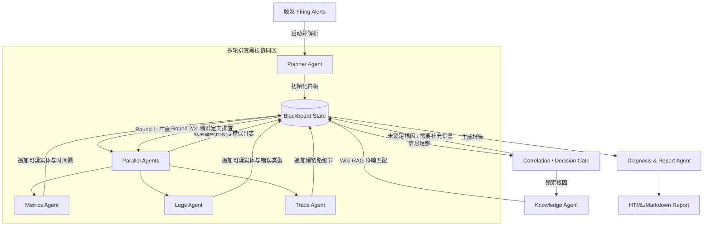

# Diting (谛听) 详细设计说明书 —— Agent Systems Simulation & Evaluation Platform

## 1. 项目定位与设计原则

### 1.1 项目定位
Diting (谛听) 是一个面向 Agent Runtime 的可重复、可评测、可扩展的分布式系统状态仿真与评估平台 (ASSEP)。本项目不是一个单纯的 AIOps 故障诊断 Demo，而是以 AIOps 为首个仿真领域的通用 Agent 系统能力评测平台。

AIOps 是平台支持的首个仿真领域。整个系统的模拟器 (Simulator)、投影层 (Projections) 与 Agent 运行时 (Runtime) 之间通过标准 MCP (Model Context Protocol) 协议完全解耦。

```
                  Scenario / Fault Injection
                             │
                             ▼
                 [ World State Engine ]
                             │ Simulation Clock (Tick)
                     State Pipeline
                             │
                             ▼
                        Event Bus
                             │ BaseEvents
        ┌────────────────────┼────────────────────┐
        ▼                    ▼                    ▼
Metrics Projection     Log Projection     Trace Projection
(Prometheus Mock)      (Loki Mock)        (Jaeger/OTel Mock)
        │                    │                    │
        ▼                    ▼                    ▼
  Prometheus MCP          Loki MCP            Trace MCP
        │                    │                    │
        └────────────────────┼────────────────────┘
                             ▼ MCP Protocol (Tools)
                 [ LangGraph Multi-Agent ]
                             │
                             ▼ Diagnosis Report
                 [ Evaluation Engine ] <--- Ground Truth
```

### 1.2 五大设计原则 (Design Principles)
* **Deterministic (确定性)**: 引入统一的 `Simulation Clock`，所有状态推演和故障注入均在确定性的虚拟时钟刻度下运行，确保 Benchmark 的 100% 可重复性。
* **Single Source of Truth (单一事实源)**: 以 World State Engine 中的 `Entity` 物理状态为唯一事实源，可观测性指标、日志和 Traces 均是从该事实源投影所得。
* **Event-Driven (事件驱动)**: 状态演进发生的所有物理资源水位变动、方法调用、超时、OOM 等均向统一的 `Event Bus` 投递 `BaseEvent`，由投影层分流处理。
* **Framework Agnostic (框架无关)**: 仿真层与运行时通过标准 MCP 协议通信，Agent 运行时可自由替换为 LangGraph, AgentScope, AutoGen 等。
* **Evaluation First (评估先行)**: 故障剧本（Scenario）不仅包含 Root Cause，还约束了 Investigation Path (调查路径) 的 Ground Truth，实现多维度的自动化 Benchmark 评分。

### 1.3 开发与包管理约束 (Environment Constraints)
* **虚拟环境与包管理**: 本项目开发与运行环境强制使用 **`uv`** 管理（如通过 `uv venv` 创建虚拟环境，使用 `uv pip install` 统一添加依赖）。
* **依赖加速下载**: 所有的包安装命令必须使用**阿里云 PyPI 镜像源**进行加速：
  `https://mirrors.aliyun.com/pypi/simple/`
  例：`uv pip install -r requirements.txt --index-url https://mirrors.aliyun.com/pypi/simple/`

---

## 2. 模拟器与状态机设计 (Simulator & World State Engine)

### 2.1 仿真时钟 (Simulation Clock)
管理全局 Tick 推进，确保所有数据的时间戳绝对统一，支持亚秒级细粒度仿真以模拟微服务毫秒级重试、超时和资源堆积。步长 `step_duration` 可配置（例如默认 100ms）。

* **仿真时钟类定义**:
```python
class SimulationClock:
    def __init__(self, start_time: datetime, step_duration: timedelta = timedelta(milliseconds=100)):
        self.start_time = start_time
        self.step_duration = step_duration
        self.current_tick = 0
        
    def tick(self):
        self.current_tick += 1
        
    def now(self) -> datetime:
        return self.start_time + self.current_tick * self.step_duration
```

* **现实物理 Now 偏移映射 (Real-time Time Alignment)**:
  为避免 Agent 使用相对时间（如 PromQL 中 `[5m]` 过去 5 分钟）查询 MCP 时查出历史空数据，Diting 在仿真运行结束后执行时间对齐：
  1. 记录发起评测的瞬间物理时间为 $T_{\text{real\_now}}$。
  2. 设仿真总共演进了 $N$ 个 ticks。
  3. 第 $i$ 个 tick 产生的指标/日志/Trace 在投影导出时，其时间戳 $T_{\text{event}}(i)$ 动态映射为：
     $$T_{\text{event}}(i) = T_{\text{real\_now}} - (N - i) \times \text{step\_duration}$$
  这使得所有投影层数据在时间轴上永远**紧贴当前物理时间的前端**，确保 MCP 客户端相对时间查询 100% 完美命中。

### 2.2 实体抽象与依赖拓扑 (Entity & Topology)
* **Entity 抽象**: 所有的物理单元、逻辑服务、硬件组件均为 `Entity`。
  * `ServiceEntity`: 微服务组件（Gateway, OrderService, PaymentService, UserService 等）。
  * `InfraEntity`: 物理基础设施（Redis 连接池, Database 实例, Network 链路, Disk 磁盘）。
  * `HostEntity`: 虚拟机/宿主机物理节点。
* **物理资源 (Resources)**: Entity 内存只存放实际的物理资源。我们采用“逻辑级等效代替物理竞争”的极简计算模型。
* **资源上限行为与可观测信号映射表**:
  
  | 物理资源 (Resource) | 承载宿主 | 达到上限后的行为 (Behavior on Max Limit) | 可观测性信号特征 (Signals seen by Agent) |
  | :--- | :--- | :--- | :--- |
  | **Worker Threads (工作线程)** | `Service` | 触发排队 -> 排队长度 `queue_len` 增加 -> 超过 max_queue 时**直接丢弃请求 (503 Service Unavailable)**。 | Metric: QPS 跌落，503 报错率飙升；Log: `Queue full, dropping request`。 |
  | **Connection Pool (连接池 - Redis/DB)** | `Service` / `Infra` | 触发等待 -> 等待时间 `wait_time` 增加 -> 超过 `pool_timeout` (如 500ms) 触发**连接超时 (TIMEOUT)**。 | Metric: Latency 陡增（约 500ms 左右的毛刺）；Log: `Timeout waiting for connection`。 |
  | **Memory Heap (堆内存)** | `Service` | 触发频繁 GC -> CPU 飙升，服务响应极慢 -> 达到 max_heap 触发 **OOM 崩溃**。 | Metric: CPU 和 Latency 持续拉满；Log: `java.lang.OutOfMemoryError`。 |
  | **Disk Space (磁盘空间)** | `Host` | 导致所有依赖写入的服务写 IO 失败，抛出 **Write IO Exception**。 | Metric: 错误率上升；Log: `No space left on device`。 |

* **共享资源等效计算**: 两个服务共用一个 Redis 或 DB 时，不引入复杂的线程锁竞争调度。由 Pipeline 在 Tick 演进中进行求和判定：
  $$\text{Redis.active\_connections} = \text{ServiceA.redis\_conns} + \text{ServiceB.redis\_conns}$$
  当求和值超出 `Redis.capacity` 时，在两端同步返回获取连接失败/超时。
* **衍生指标 (Derived Metrics)**: 指标（CPU, Latency, Error Rate）不是静态存储的值，而是基于物理状态的派生计算量，保证数据永不同步：
  $$\text{CPU Usage} = f(\text{active\_workers}, \text{heap\_used}) \pm \text{Noise}$$
* **加权拓扑图 (Topology Graph)**: 显式区分调用的分支语义：
  * **Fan-out (并行扇出)**: 同时调用所有依赖（如 Gateway 并行调用 OrderService 和 UserService），各边权重为流量分流比。
  * **Route (路由选择)**: 根据权重进行加权随机游走，单次 Request 只走被选中的那条物理路径。
  ```python
  topology = {
      "Gateway": {
          "type": "fan_out",
          "dependencies": {"OrderService": 1.0, "UserService": 1.0}
      },
      "OrderService": {
          "type": "route",
          "dependencies": {"PaymentService": 0.8, "InventoryService": 0.2}
      }
  }
  ```

### 2.3 状态演进管道 (State Evolution Pipeline)
每个 Tick 时，引擎按顺序流经流水线，防止 rule-chain 混乱：
1. **Update Request**: 
   * 根据当前 QPS 生成 `Request` 对象，并在创建时按照拓扑图的 `type`（加权随机游走或扇出并发）生成该请求的**实际调用 Span 树骨架**。
   * 每个 Span 节点结构定义为：
     ```python
     class SpanNode:
         span_id: str
         parent_span_id: Optional[str]
         service: str
         status: str             # "OK", "ERROR", "TIMEOUT"
         duration: float         # 实际耗时
         retry_count: int        # 重试次数 (0 代表无重试)
         error_message: str      # 错误语义
         children: List['SpanNode']
     ```
2. **Update Queue**: 根据并发 QPS 与服务处理能力计算各 Entity 的排队长度。
3. **Update Resource**: 分配/抢占底层基础设施物理资源。若资源耗尽，向 Event Bus 抛出异常事件。
4. **Update Dependency (故障状态写入与重试生成)**:
   * 沿着拓扑自底向上流经 Request Span 树。
   * 如果某个物理实体 (如 Redis) 处于耗尽/超时状态，直接作用于当前流经该实体的 `Request` 对应 SpanNode 节点，将其标记为 `status: ERROR` 或 `TIMEOUT`，并记录 `error_message`。
   * 若服务配置了 `retry_policy`，根据错误状态在此 Span 下追加**同层的重试子 Span 节点**，以此来模拟重试逻辑。
5. **Update Metrics & Generate Events**: 整合并投递事件；请求结束后在 **Trace Projection** 侧自底向上组装并持久化这棵完整的 Span 树，投递 `TraceFinishedEvent`。

### 2.4 噪点机制 (Noise) 与可控随机种子 (Seed)
为了让系统既具备真实世界的噪点，又满足 **100% 可重复 (Deterministic)** 的 Benchmark 标准，Diting 引入了基于故障剧本（Scenario）声明的**局部伪随机生成器 (Local PRNG) 隔离机制**：

1. **剧本声明 Seed**: 每个故障剧本可显式声明一个随机数种子（如 `seed: 42`，默认为 42）。
2. **局部生成器隔离**: 仿真引擎在启动时，基于该 Seed 实例化一个独立的 Python `random.Random(seed)` 实例。所有加噪操作均使用该局部实例进行，防止全局随机数状态干扰。
3. **具体噪点逻辑**:
   * **衍生指标扰动**: 计算派生指标（如 CPU）时，使用 `random_gen.uniform(-2.0, 2.0)` 随机加上 $\pm 2\%$ 以内的白噪声。
   * **非故障偶发日志**: 投影层在消费非故障事件时，以 `random_gen.random() < 0.001` 的固定概率混入偶发的 `WARN` 网络抖动日志。

通过该机制，即使系统包含高频白噪声和随机偶发报警，**只要给定相同的故障剧本和 Seed，输出的可观测指标和日志 100% 稳定可复现**。

---

## 3. 事件总线与投影设计 (Event Bus & DDD Projections)

### 3.1 统一事件结构 (BaseEvent)
```python
class BaseEvent:
    event_id: str
    tick: int
    timestamp: datetime
    entity_id: str          # 产生事件的实体 ID
    severity: str           # INFO, WARNING, ERROR, CRITICAL
    trace_id: Optional[str] # 关联的 Trace ID
    event_type: str         # "RedisPoolExhausted" / "SpanStart" / "OOM" / "SlowQuery"
    payload: dict
```

### 3.2 DDD 投影层 (Projections)
* **Metric Projection**: 每秒收集各 Entity 的 Derived Metrics，转为 Prometheus 时序快照供查询。
* **Log Projection**: 订阅 Event 队列，将 `BaseEvent` 渲染为带有上下文语义的日志。
  * *例*: `[ERROR] [trace_id: 8fa7b] PaymentService failed to acquire Redis connection (50/50 active) after 500ms.`
* **Trace Projection**: 聚合 `SpanStart` 与 `SpanEnd` 事件，组装成树状链路拓扑，可根据 `trace_id` 查询单个 Request 的全链路延迟分布。

### 3.3 Alertmanager 告警机制 (告警消解与生命周期)
World 中配置告警规则规则，当衍生指标越线并满足 `for` 持续时间时，投递 `AlertFiring` 事件。当故障恢复（例如 Scenario 声明将指标设回正常状态，或系统自愈后），指标回落，投递 `AlertResolved` 事件。

`Alertmanager Projection` 动态维护告警的状态机，提供与真实 Alertmanager 100% 格式对齐的告警生命周期表达：

1. **告警激活 (Firing)**:
   ```json
   {
     "status": "firing",
     "labels": {
       "alertname": "ServiceHighErrorRate",
       "service": "Gateway",
       "severity": "critical"
     },
     "annotations": {
       "summary": "Gateway error rate is too high (current: 12%)"
     },
     "startsAt": "2026-07-17T09:00:15Z",
     "endsAt": null
   }
   ```

2. **告警消解 (Resolved - 自动恢复仿真)**:
   ```json
   {
     "status": "resolved",
     "labels": {
       "alertname": "ServiceHighErrorRate",
       "service": "Gateway",
       "severity": "critical"
     },
     "annotations": {
       "summary": "Gateway error rate is resolved"
     },
     "startsAt": "2026-07-17T09:00:15Z",
     "endsAt": "2026-07-17T09:00:30Z"
   }
   ```

这对于评测 Agent 具有重大的区分度。当 Agent 通过 Knowledge / Prometheus 检查时，如果发现告警状态已转为 `resolved`，能够智能评估出故障为“瞬态抖动并已自动恢复”，从而把排查动作切换为“历史原因关联”，避免发出多余的紧急处理指令。

---

## 4. 声明式故障剧本与组合 (Scenario Composition)

### 4.1 声明式配置
不定义动作 (Action)，只声明状态偏移。支持 `include` 实现剧本组合：
```yaml
name: complex_cascade_failure
description: 流量激增与 Redis 连接池泄漏组合的级联故障
include:
  - scenarios/traffic_spike.yaml
  - scenarios/redis_pool_leak.yaml
steps:
  - tick: 15
    target: "Node-1.resources.disk_util"
    value: 0.96
```

---

## 5. Mock MCP 服务与数据流设计

为了支持多进程隔离及 MCP Server（独立进程）与仿真引擎之间的数据交换，Diting 采用 **Session 隔离 + 内存级 State HTTP Server** 的无盘化共享机制：

### 5.1 会话隔离与共享内存结构
1. **Session 绑定**: 每次故障剧本运行产生唯一的 `session_id`。所有投影层（Projections）的输出只保存在内存中该 `session_id` 下的字典结构内。
2. **State Server (仿真端提供)**: Diting 运行时启动一个极简的内存 Web API Server。MCP 服务和评估引擎均通过唯一的 `session_id` 进行基于 HTTP 的只读查询：
   * `GET /api/v1/metrics?session_id=xxx&metric=name&start=...&end=...`
   * `GET /api/v1/logs?session_id=xxx&service=name&level=severity`
   * `GET /api/v1/traces?session_id=xxx&trace_id=id`
3. **无锁数据销毁**: 评测完毕后，Evaluator 调用 `DELETE /api/v1/session?session_id=xxx` 物理清空该会话内存，零磁盘 I/O 开销，彻底避免多进程 SQLite 文件锁锁死问题。

### 5.2 MCP Server 暴露的 Tools
每个投影层对应的 MCP 服务通过 `FastMCP` 启动独立进程，通过上述 HTTP 接口向 Diting 仿真引擎拉取数据并对外暴露 Tools：
* **Prometheus MCP**: 提供 `query_range(session_id, metric_name, start, end)` 工具。
* **Loki MCP**: 提供 `query_logs(session_id, service, query_term, start, end, severity)` 工具。
* **Trace MCP**: 提供 `query_traces(session_id, trace_id)` 链路查询。
* **Knowledge MCP**: 提供 `search_runbooks(session_id, query_term)` 工具。
  * **Wiki 混淆降噪设计**: 知识库内部不直接提供精准的 1 对 1 关联结果，而是混合了 **90% 的公司日常无关运维 Wiki**（如值班守则、数据库物理备份操作手册、常规虚拟机磁盘挂载指南等）。
  * **RAG 召回比对**: Agent 调用时必须提供明确的 `query_term` 关键词，系统基于简易 TF-IDF 倒排索引或词义匹配召回 Top-3 文档，以评估 Agent 在嘈杂的 Runbook 文本中进行降噪、定位与实体关联提取的能力。

---

## 6. LangGraph Multi-Agent Runtime 设计

整个诊断 Agent 采用基于 **LangGraph StateGraph** 的**多轮黑板协作流 (Blackboard Collaboration Loop)**。各子 Agent 通过在共享状态中读写“排查白板”，进行精细的交互式深度排查，避免单次全量捞取导致 Token 爆炸或在噪声中迷失。



### 6.1 状态结构定义 (Blackboard State)
使用 LangGraph 状态通道存储 `IncidentState`，新增 `blackboard` 白板字段用于协同流转：
```python
class IncidentState(TypedDict):
    firing_alerts: List[dict]
    # 排查白板：记录多轮排查中动态更新的上下文
    blackboard: dict {
        "suspect_entities": List[str],       # 当前各 Agent 筛选出的可疑实体列表
        "suspect_time_ranges": List[dict],   # 异常波动的具体时间段，格式：{start, end}
        "investigation_round": int,          # 当前轮次 (最大 3 轮)
        "suggested_actions": List[str],      # 轮次间指派的定向拉取任务
    }
    metrics_evidence: List[dict]             # metrics 证据链
    logs_evidence: List[dict]                # 日志证据链
    trace_evidence: List[dict]               # 链路追踪证据链
    runbooks: List[str]                      # 匹配到的 Runbook 候选文档
    diagnosis_conclusion: dict               # 根因结论
```

### 6.2 协同排查执行流程 (Blackboard Loop Flow)
1. **Round 1 (广度扫描)**: 
   * Planner 初始化白板，根据告警 labels 设置初始 `suspect_entities` (如 `["Gateway"]`)。
   * Metrics, Logs, Trace Agent 并行拉取 Gateway 本身的基础时序与全局日志，在白板中记录 Gateway Latency 突增点，追加下层可疑实体（如在白板中写入 `suspect_entities: ["Gateway", "OrderService"]`，`suspect_time_ranges: [{"start": 12, "end": 25}]`）。
2. **Round 2 (深度追踪)**:
   * **Logs Agent** 看到 `OrderService` 进入白板，定向去拉取 `OrderService` 在对应时间段内的错误日志，发现连接池满错误，在白板中追加 `suspect_entities: ["Redis"]`。
   * **Trace Agent** 定向追踪包含 `OrderService` 的 slow trace，寻找重试 Span 特征。
3. **Decision Gate (条件判断与决策门)**:
   * `Correlation Agent` 对当前白板中的证据进行融合。如果链路关系与报错已能互相闭环，则决定终止 Loop，否则触发 Round 3 追加查询。
   * 锁定根因为 Redis 泄漏后，`Knowledge Agent` 使用关键字去 RAG 文档库搜索并过滤混淆 wiki，将正确 Runbook 追加至 State。
4. **Diagnosis (终报输出)**:
   * 诊断 Agent 整理所有状态中的 evidences，输出 Pydantic 结构化证据（用于 Evaluator 打假比对）及排查 Timeline 报告。

* **职责隔离**: Metrics/Logs/Trace Agent 独立运行，且分别只绑定与之对应的 MCP Server 工具，严格禁止跨界查询。

---

## 7. 评估引擎设计 (Evaluation Engine)

### 7.1 Ground Truth 格式
```yaml
scenario: complex_cascade_failure
ground_truth:
  root_cause:
    service: "PaymentService"
    entity: "RedisConnectionPool"
    type: "redis_pool_leak"
  expected_investigation_path:
    expected_tools: ["query_range", "query_logs", "query_traces"]
    expected_services: ["Gateway", "PaymentService", "Redis"]
    expected_metrics: ["redis_active_connections", "service_latency"]
  timeline:
    - step: 1
      entity: "Redis"
      description: "Connection leak begins"
    - step: 2
      entity: "PaymentService"
      description: "Redis connections exhausted, latency spikes"
```

### 7.2 评估指标 (Metrics)
* **Root Cause Accuracy**: 根因服务与类型的精确/语义匹配度。
* **Path Recall (路径召回率)**: 比对 LangFuse 中收集到的 Agent Tool Calls 与标准答案中的 `expected_tools` & `expected_metrics`，评估 Agent 是否走了弯路。
* **Reasoning Quality (推理质量)**: 使用 GPT-4/Claude 3.5 对 Agent 报告 of Timeline 推导和 Evidence 逻辑进行 1-10 语义评分。
* **Efficiency (效率)**: 运行耗时、LLM Token 消耗量、Tool 调用次数。
* **Anti-Hallucination (抗幻觉度)**: 评估 Agent 是否在诊断中胡编乱造指标与日志。为了确保算法可落地，我们要求 Agent 输出 Pydantic 结构化的 `evidence` 字段，由 Evaluator 结合以下匹配逻辑在 Projections 数据中进行打假：
  * **时间窗口容差 (Time Window)**: 允许 $\pm 5\text{s}$ (即 50 个 ticks) 的时间误差。Agent 宣称的时间戳 $t_{\text{agent}}$ 与真实数据时间戳 $t_{\text{real}}$ 的差绝对值在范围内即通过。
  * **数值区间容差 (Value Range)**: 允许 $10\%$ 的相对误差（或 $\pm 5\%$ 的绝对百分比误差）。公式为 $\frac{|V_{\text{agent}} - V_{\text{real}}|}{V_{\text{real}}} \le 10\%$。
  * **日志语义相似度 (Log Match)**: 先运行字面不区分大小写的包含匹配；若不匹配，则计算 Embedding 相似度值或 LLM 语义等效评估（相似度 $\ge 0.8$），判定其是否指向同一物理日志。

---

## 8. 一周开发计划 (Day 1 - Day 7)

* **Day 1**: 世界引擎基建。实现 `SimulationClock`, `Entity`, `Weighted Topology`, `State Evolution Pipeline` 及噪声。
* **Day 2**: 故障剧本与事件总线。实现声明式 `Scenario` 组合、`Event Bus` 及 `BaseEvent` 投递。
* **Day 3**: DDD 投影层与 Alertmanager。实现 `Metric/Log/Trace/Alert Projections`，支持将事件持久化并导出标准 Alertmanager 格式告警。
* **Day 4**: Mock MCP Servers。使用 `FastMCP` 分别实现 Prometheus, Loki, Trace, Knowledge 的 MCP 独立服务。
* **Day 5**: LangGraph Runtime。搭建基于 StateGraph 的 Planner 及职责隔离的子 Agents 诊断链。
* **Day 6**: Evaluation Engine。实现 Ground Truth 结构、多维打分算法（Accuracy, Path Recall, Hallucination Check）。接入 LangFuse。
* **Day 7**: README 文档、架构图渲染，完成系统整体 Benchmark 跑通与演示。
