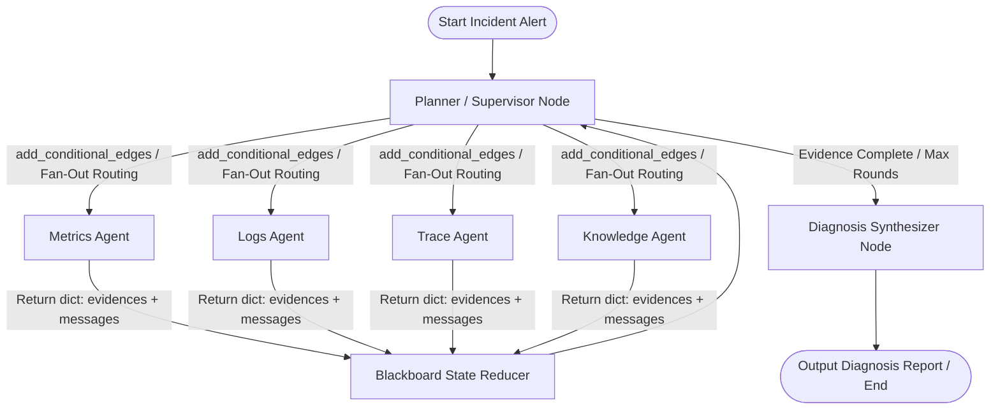

# Day 5 Spec Design: LangGraph Multi-Agent Agent Runtime (Diting 谛听)

## 1. 概述与设计目标

Diting (谛听) 是一个分布式系统状态仿真与 Agent 评估平台 (ASSEP)。Day 5 的核心任务是搭建 **`runtime/` 模块**，基于 **LangChain** 与 **LangGraph** 实现多 Agent 黑板协同诊断流（Blackboard Collaboration Loop）。

### 核心目标：
1. **黑板状态驱动 (Blackboard Shared State)**：全过程由统一的 `BlackboardState` 驱动，各领域 Specialist Agent 不保持私有持久状态，所有证据与观察推导均写入共享黑板。
2. **职责隔离 (Separation of Concerns)**：包含 Prometheus (Metrics)、Loki (Logs)、Trace 与 Knowledge (Runbooks) 四类独立 Specialist Agent 节点，避免单 Agent 工具过载。
3. **多轮循迹与并行派发 (Parallel Dispatch & Multi-Round Directed Investigation)**：Round 1 允许 Supervisor 并行派发多个 Specialist Agent 进行广度扫描；Round 2+ 结合白板上的 `suspect_entities` 进行定向日志与链路拉取。
4. **确定性与无 Key 单测支持 (Mock LLM Engine)**：提供可配置的 LLM 接口，包含内置的 `MockLLMClient`，确保在无网络 / 无 OpenAI API Key 环境下，单元测试与 CI 能够 100% 通过。

---

## 2. 架构决策与对比 (Architecture Decision Records)

### 2.1 为什么不选择 Deep Agents 框架？
* **需求不匹配**：Deep Agents 提供了虚拟文件系统、终端 Shell 与重型 Skill 挂载机制，面向通用的代码编写与操作系统控制 Agent。
* **Benchmark 可控性与性能要求**：Diting 是可重复、可评测的微服务故障仿真诊断平台，要求对 Token 消耗、调查路径 (Path Recall)、Pydantic 证据结构与时间窗口误差进行精确判定。纯 LangGraph `StateGraph` 具备更高的轻量性、确定性与微观控制力。

### 2.2 为什么拒绝过时的 `langgraph-supervisor` 包？
* `langgraph-supervisor` 属于官方已停止维护的过渡库。Diting 统一基于原生的 LangGraph `StateGraph` + `create_agent` / 函数式 Node 构建，确保代码具备最佳的可维护性与前向兼容性。

---

## 3. 架构设计与状态流 (Graph Architecture)

基于 LangGraph 原生 `StateGraph` 的多 Agent 黑板并行派发架构如下：



> **注**：Supervisor 通过 LangGraph 条件边 `add_conditional_edges`（基于 `Send` API 或节点数组）直接路由到目标 Specialist Node，无额外的图逻辑中间节点开销。

### 节点与状态流转约定：

| 节点名称 | 核心职责 | 输入状态 | 依赖工具 / MCP | 输出 (Dict Key-Value) |
| :--- | :--- | :--- | :--- | :--- |
| **`Supervisor`** | 完整 Converse Agent，分析黑板并并发决定派发目标 Agent 列表 | `BlackboardState` | LLM + Structured Output / Router | `{"next_steps": list[str], "current_round": round+1}` |
| **`MetricsNode`** | 检索 Prometheus 时序指标 (CPU/Mem/QPS/Latency) | `suspect_entities` | Prometheus MCP + `InjectedToolCallId` | `{"evidences": [Evidence], "messages": [ToolMessage]}` |
| **`LogsNode`** | 检索 Loki 日志，分析 Exception 堆栈 | `suspect_entities`, 时段 | Loki MCP + `InjectedToolCallId` | `{"evidences": [Evidence], "messages": [ToolMessage]}` |
| **`TraceNode`** | 检索分布式调用链，分析 High-latency Span | `suspect_entities`, TraceID | Trace MCP + `InjectedToolCallId` | `{"evidences": [Evidence], "messages": [ToolMessage]}` |
| **`KnowledgeNode`** | 检索运维 Wiki 与故障 Runbook | 关键词, 现象描述 | Knowledge MCP + `InjectedToolCallId` | `{"evidences": [Evidence], "messages": [ToolMessage]}` |
| **`Synthesizer`** | 聚合所有 Evidence 生成结构化诊断报告 | `BlackboardState` | LLM Structured Output | `{"diagnosis_report": DiagnosisReport, "status": "COMPLETED"}` |

---

## 4. 数据模型与 Schema 设计 (`runtime/schema.py`)

统一使用 **Pydantic v2** 强类型定义，遵循 Fail-Fast 原则。

```python
from typing import Annotated, Literal, TypedDict
from pydantic import BaseModel, Field
from langchain_core.messages import BaseMessage
import operator

# --- 证据结构 ---
class Evidence(BaseModel):
    id: str
    source: Literal["metric", "log", "trace", "runbook"]
    entity_id: str
    timestamp: str  # ISO 8601 UTC string (+00:00)
    summary: str
    details: dict = Field(default_factory=dict)
    relevance_score: float = 1.0

# --- 根因诊断报告 ---
class DiagnosisReport(BaseModel):
    root_cause_entity: str
    failure_type: str  # e.g., "CPU_BURST", "MEMORY_LEAK", "NETWORK_LATENCY"
    confidence: float  # 0.0 - 1.0
    evidence_ids: list[str]
    summary: str
    recommended_actions: list[str] = Field(default_factory=list)

ValidNodeName = Literal["MetricsNode", "LogsNode", "TraceNode", "KnowledgeNode", "Synthesizer"]

# --- Supervisor 结构化决议 ---
class SupervisorDecision(BaseModel):
    next_steps: list[ValidNodeName] = Field(
        description="List of exact node names to dispatch. MUST be selected from: 'MetricsNode', 'LogsNode', 'TraceNode', 'KnowledgeNode', 'Synthesizer'."
    )
    suspect_entities: list[str] = Field(
        default_factory=list,
        description="List of suspect entity IDs identified during investigation.",
    )
    reasoning: str = Field(
        default="",
        description="Brief rationale for the routing decision.",
    )

# --- LangGraph 黑板共享状态 ---
class BlackboardState(TypedDict):
    messages: Annotated[list[BaseMessage], operator.add]
    incident_alert: dict
    suspect_entities: list[str]
    evidences: Annotated[list[Evidence], operator.add]
    matched_runbooks: Annotated[list[dict], operator.add]
    current_round: int
    max_rounds: int
    next_steps: list[str]  # 并发派发列表，例如 ["MetricsNode", "LogsNode"]
    diagnosis_report: DiagnosisReport | None
    status: Literal["RUNNING", "COMPLETED", "FAILED"]
```

---

## 5. Node Wrapper、Tool 绑定、Prompt 模板与 Checkpointer (`runtime/tools/`, `runtime/agents/` & `runtime/prompts.py`)

### 5.1 Tool 函数与 LangGraph Node Wrapper 函数的边界规范
明确区分底层 Tool 函数与 LangGraph Node 函数的职责和返回值规范：

- **底层 MCP Tool 集成与 LangChain Adapters** (`runtime/tools/mcp_tools.py`)：使用 `langchain_mcp_adapters` 接入后端 MCP Streamable HTTP 协议服务（`http://127.0.0.1:8001/mcp/sse` 等），并向后兼容 Mock/Injected 工具生成标准 `Evidence` 与 `ToolMessage`。

- **LangGraph Node Wrapper** (`runtime/agents/metrics_agent.py` 等)：遵循 LangGraph 节点标准接口 `(state: BlackboardState) -> dict[str, Any]`：
```python
def metrics_node(state: BlackboardState) -> dict[str, Any]:
    # 包装 MCP 工具调用并将结果映射为可被 State Reducer 消费的字典
    evidence, tool_msg = query_prometheus_metrics_tool(...)
    return {
        "evidences": [evidence],
        "messages": [tool_msg]
    }
```

### 5.2 Agent 提示词隔离 (`runtime/prompts.py`) 与 LLM 结构化输出
为避免提示词与 Graph/Agent 逻辑紧耦合，在 `runtime/prompts.py` 中集中定义与管理：
- `SUPERVISOR_SYSTEM_PROMPT` / `SUPERVISOR_HUMAN_PROMPT`：定义编排策略与黑板上下文渲染。
- `SYNTHESIZER_SYSTEM_PROMPT` / `SYNTHESIZER_HUMAN_PROMPT`：定义诊断报告合成规范。

在 `Supervisor` 和 `Synthesizer` 节点中，使用 `llm.with_structured_output(SupervisorDecision)` 与 `llm.with_structured_output(DiagnosisReport)` 进行强类型 LLM 提取，配合 `NODE_NAME_MAP` 别名规整（如 `metricsnode` -> `MetricsNode`），确保动态派发的稳健性。

### 5.3 MockLLMClient 并行 ToolCall 策略
为了支持无网络 / 无 API Key 下的确定性多轮并发单测：
- `MockLLMClient` 实现 `invoke(state: BlackboardState)`。
- 根据 `state["current_round"]` 与白板内容，按轮次确定性返回：
  - **Round 1**：返回并发派发列表 `{"next_steps": ["MetricsNode", "LogsNode", "TraceNode", "KnowledgeNode"]}`。
  - **Round 2**：返回定向派发列表 `{"next_steps": ["LogsNode"]}` 并更新 `suspect_entities: ["order-service"]`。
  - **Round 3**：证据闭环，返回 `{"next_steps": ["Synthesizer"]}`。

### 5.4 上下文降噪与 Checkpointer 反序列化注册
- **证据摘要 (Summary)**：MCP 原始响应均在 Node 内格式化提炼为 `Evidence.summary`，避免 Raw Log/Trace 的 Context Bloat。
- **MemorySaver 与 JsonPlusSerializer**：在 `runtime/graph.py` 中，显式将 `("runtime.schema", "Evidence")`、`("runtime.schema", "DiagnosisReport")` 和 `("runtime.schema", "SupervisorDecision")` 注册至 `JsonPlusSerializer(allowed_msgpack_modules=...)`，避免快照恢复时的 msgpack 警报并支持基于 `thread_id` 的状态审计回溯。

---

## 6. 模块代码结构与文件部署

```text
runtime/
├── __init__.py
├── schema.py              # Pydantic 模型 (Evidence, DiagnosisReport, SupervisorDecision) 与 BlackboardState 定义
├── llm.py                # ChatOpenAI LLM 客户端工厂 (get_llm)
├── mock_llm.py            # 离线/测试 Mock LLM 驱动 (基于轮次返回并发/定向 next_steps)
├── prompts.py            # Agent 提示词模板集 (Supervisor & Synthesizer 消息模板)
├── tools/                 # MCP 服务适配与 InjectedToolCallId 包装 (mcp_tools.py)
├── agents/                # 各 Node Wrapper 节点实现 (返回 dict[str, Any])
│   ├── __init__.py
│   ├── supervisor.py      # Planner / Supervisor Agent Node (with_structured_output)
│   ├── metrics_agent.py   # Prometheus Metrics Agent Node Wrapper
│   ├── logs_agent.py      # Loki Logs Agent Node Wrapper
│   ├── trace_agent.py     # Distributed Trace Agent Node Wrapper
│   ├── knowledge_agent.py # Knowledge Runbook Agent Node Wrapper
│   └── synthesizer.py     # Root Cause Synthesizer Node
└── graph.py               # 原生 StateGraph 组装 (add_conditional_edges 并发路由 + JsonPlusSerializer MemorySaver)
```

---

## 7. 验证计划 (Verification Plan)

### 7.1 静态代码与格式检查
运行 `AGENTS.md` 规范要求的验证三步法：
```bash
uv run ruff check --fix .
uv run ruff format .
uv run pytest
```

### 7.2 自动化单元测试 (`tests/runtime/`)
1. **`test_schema.py`**：验证 `BlackboardState` 的并发 Reducer 与 Pydantic 模型 Validation。
2. **`test_mcp_tools.py`**：验证 `InjectedToolCallId` 与 `ToolMessage` 的正确生成及 MCP 通信。
3. **`test_agents.py`**：验证 Node Wrapper 函数返回标准 `dict[str, Any]`。
4. **`test_graph_workflow.py`**：测试含 `MemorySaver` Checkpointer 的 `run_diagnosis_workflow()`，验证 Round 1 并行派发 ➔ Round 2 深度定向 ➔ 导出 `DiagnosisReport` 的全流程。
