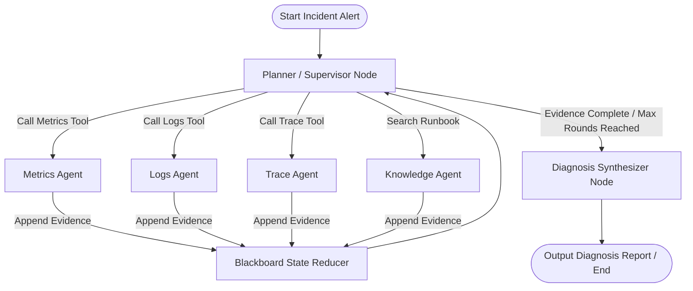

# Day 5 Spec Design: LangGraph Multi-Agent Agent Runtime (Diting 谛听)

## 1. 概述与设计目标

Diting (谛听) 是一个分布式系统状态仿真与 Agent 评估平台。Day 5 的核心任务是搭建 **`runtime/` 模块**，基于 **LangChain** 与 **LangGraph** 实现多 Agent 黑板协同诊断流（Blackboard Collaboration Loop）。

### 核心目标：
1. **黑板状态驱动 (Blackboard Shared State)**：全过程由统一的 `BlackboardState` 驱动，各领域 Specialist Agent 不保持私有持久状态，所有证据与观察推导均写入共享黑板。
2. **职责隔离 (Separation of Concerns)**：包含 Prometheus (Metrics)、Loki (Logs)、Trace 与 Knowledge (Runbooks) 四类独立 Specialist Agent 节点，避免单 Agent 工具过载。
3. **多轮循迹 (Multi-Round Directed Investigation)**：Round 1 进行全局指标/故障点广度检索，Round 2+ 结合白板上的 `suspect_entities` 进行定向日志与链路拉取。
4. **确定性与无 Key 单测支持 (Mock LLM Engine)**：提供可配置的 LLM 接口，包含内置的 `MockLLMClient`，确保在无网络 / 无 OpenAI API Key 环境下，单元测试与 CI 能够百分之百通过。

---

## 2. 架构设计与状态流 (Graph Architecture)

基于 LangGraph `StateGraph` 的 Supervisor 协作模式架构如下：



### 节点职责清单：

| 节点名称 | 核心职责 | 输入状态 | 依赖工具 / MCP | 输出/状态变更 |
| :--- | :--- | :--- | :--- | :--- |
| **`Supervisor`** | 决策调度门，分析当前黑板，选择下一步派发的目标 Agent 或进入总结阶段 | `BlackboardState` | LLM + Tool Router / Structured Output | `next_step`, `current_round`+1 |
| **`MetricsNode`** | 检索 Prometheus 时序指标 (CPU/Mem/QPS/Latency/Errors) | `suspect_entities` | Prometheus MCP (`query_instant`, `query_range`) | 追加 `MetricEvidence` 至 `evidences` |
| **`LogsNode`** | 检索 Loki 日志，分析关键字及 Exception 异常栈 | `suspect_entities`, 时段 | Loki MCP (`query_logs`, `list_services`) | 追加 `LogEvidence` 至 `evidences` |
| **`TraceNode`** | 检索分布式调用链，分析 High-latency Span 与 HTTP 错误码 | `suspect_entities`, TraceID | Trace MCP (`get_trace`, `search_traces`) | 追加 `TraceEvidence` 至 `evidences` |
| **`KnowledgeNode`** | 基于问题现象检索运维 Wiki 与故障 Runbook | 关键词, 现象描述 | Knowledge MCP (`search_runbooks`) | 追加 `Runbook` 至 `matched_runbooks` |
| **`Synthesizer`** | 聚合所有 Evidence，进行根因推导并生成结构化诊断报告 | `BlackboardState` | LLM Structured Output | `diagnosis_report`, `status="COMPLETED"` |

---

## 3. 数据模型与 Schema 设计 (`runtime/schema.py`)

所有状态与模型统一使用 **Pydantic v2** 强类型定义，遵循 Fail-Fast 原则。

```python
from typing import Annotated, Literal, TypedDict
from pydantic import BaseModel, Field
from langchain_core.messages import BaseMessage
import operator

# --- 证据结构 ---
class Evidence(BaseModel):
    id: str
    source: Literal["metric", "log", "trace", "runbook"]
    entity_id: str
    timestamp: str  # ISO 8601 UTC string (+00:00)
    summary: str
    details: dict = Field(default_factory=dict)
    relevance_score: float = 1.0

# --- 根因诊断报告 ---
class DiagnosisReport(BaseModel):
    root_cause_entity: str
    failure_type: str  # e.g., "CPU_BURST", "MEMORY_LEAK", "NETWORK_LATENCY"
    confidence: float  # 0.0 - 1.0
    evidence_ids: list[str]
    summary: str
    recommended_actions: list[str] = Field(default_factory=list)

# --- LangGraph 黑板共享状态 ---
class BlackboardState(TypedDict):
    messages: Annotated[list[BaseMessage], operator.add]
    incident_alert: dict
    suspect_entities: list[str]
    evidences: Annotated[list[Evidence], operator.add]
    matched_runbooks: list[dict]
    current_round: int
    max_rounds: int
    next_step: str  # "MetricsNode", "LogsNode", "TraceNode", "KnowledgeNode", "Synthesizer", "__end__"
    diagnosis_report: DiagnosisReport | None
    status: Literal["RUNNING", "COMPLETED", "FAILED"]
```

---

## 4. MCP 工具封装与 Mock 运行层 (`runtime/tools/` & `runtime/mock_llm.py`)

### 4.1 MCP Tools 接入 (`runtime/tools/mcp_tools.py`)
在 `runtime` 层提供直接调用 Day 4 MCP Services 的 Python Adapter 库：
- `query_prometheus_metrics(query: str, start: str, end: str)`
- `query_loki_logs(service: str, query: str, limit: int)`
- `search_distributed_traces(service: str, min_duration_ms: float)`
- `search_knowledge_runbooks(query: str, top_k: int)`

### 4.2 Mock LLM Client (`runtime/mock_llm.py`)
为了在无真实 OpenAI/DeepSeek API Key 的离线环境下运行 `uv run pytest`：
- 实现一个规则确定的 `MockLLMClient`。
- 根据 `BlackboardState` 中的警报信息与轮次，返回结构化的 Tool Calls 或 `DiagnosisReport`。

---

## 5. 模块代码结构与文件部署

```text
runtime/
├── __init__.py
├── schema.py              # Pydantic 强类型模型与 BlackboardState 定义
├── mock_llm.py            # 离线/测试 Mock LLM 驱动
├── tools/                 # MCP 服务适配与 LangChain StructuredTool 包装
│   ├── __init__.py
│   └── mcp_tools.py
├── agents/                # 各节点实现
│   ├── __init__.py
│   ├── supervisor.py      # Planner / Supervisor Node
│   ├── metrics_agent.py   # Prometheus Metrics Node
│   ├── logs_agent.py      # Loki Logs Node
│   ├── trace_agent.py     # Distributed Trace Node
│   ├── knowledge_agent.py # Knowledge Runbook Node
│   └── synthesizer.py     # Root Cause Synthesizer Node
└── graph.py               # StateGraph 组装编译与主执行接口 run_diagnosis_workflow()
```

---

## 6. 验证计划 (Verification Plan)

### 6.1 静态代码与格式检查
运行 `AGENTS.md` 规范要求的验证三步法：
```bash
uv run ruff check --fix .
uv run ruff format .
uv run pytest
```

### 6.2 自动化单元测试 (`tests/runtime/`)
1. **`test_schema.py`**：验证 `BlackboardState` 状态 Reducer 及 Pydantic 模型 Validation。
2. **`test_mcp_tools.py`**：验证 Agent Tools 封装与底层 MCP 服务的网络通信。
3. **`test_agents.py`**：验证 Supervisor、MetricsAgent、LogsAgent 等单节点的逻辑输出。
4. **`test_graph_workflow.py`**：测试全链路 `run_diagnosis_workflow()` 离线黑板诊断，验证从 Alert 接入到最终 `DiagnosisReport` 导出的完整 LangGraph 状态图演进。
