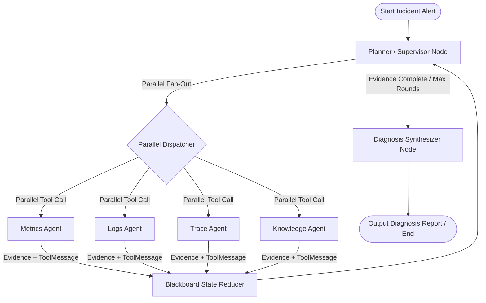

# Day 5 Spec Design: LangGraph Multi-Agent Agent Runtime (Diting 谛听)

## 1. 概述与设计目标

Diting (谛听) 是一个分布式系统状态仿真与 Agent 评估平台 (ASSEP)。Day 5 的核心任务是搭建 **`runtime/` 模块**，基于 **LangChain** 与 **LangGraph** 实现多 Agent 黑板协同诊断流（Blackboard Collaboration Loop）。

### 核心目标：
1. **黑板状态驱动 (Blackboard Shared State)**：全过程由统一的 `BlackboardState` 驱动，各领域 Specialist Agent 不保持私有持久状态，所有证据与观察推导均写入共享黑板。
2. **职责隔离 (Separation of Concerns)**：包含 Prometheus (Metrics)、Loki (Logs)、Trace 与 Knowledge (Runbooks) 四类独立 Specialist Agent 节点，避免单 Agent 工具过载。
3. **多轮循迹与并行派发 (Parallel Dispatch & Multi-Round Directed Investigation)**：Round 1 允许 Supervisor 并行派发多个 Specialist Agent 进行广度扫描；Round 2+ 结合白板上的 `suspect_entities` 进行定向日志与链路拉取。
4. **确定性与无 Key 单测支持 (Mock LLM Engine)**：提供可配置的 LLM 接口，包含内置的 `MockLLMClient`，确保在无网络 / 无 OpenAI API Key 环境下，单元测试与 CI 能够 100% 通过。

---

## 2. 架构决策与对比 (Architecture Decision Records)

### 2.1 为什么不选择 Deep Agents 框架？
* **需求不匹配**：Deep Agents 提供了虚拟文件系统、终端 Shell 与重型 Skill 挂载机制，面向通用的代码编写与操作系统控制 Agent。
* **Benchmark 可控性与性能要求**：Diting 是可重复、可评测的微服务故障仿真诊断平台，要求对 Token 消耗、调查路径 (Path Recall)、Pydantic 证据结构与时间窗口误差进行精确判定。纯 LangGraph `StateGraph` 具备更高的轻量性、确定性与微观控制力。

### 2.2 为什么拒绝过时的 `langgraph-supervisor` 包？
* `langgraph-supervisor` 属于官方已停止维护的过渡库。Diting 统一基于原生的 LangGraph `StateGraph` + `create_agent` / 函数式 Node 构建，确保代码具备最佳的可维护性与前向兼容性。

---

## 3. 架构设计与状态流 (Graph Architecture)

基于 LangGraph 原生 `StateGraph` 的多 Agent 黑板并行派发架构如下：



### 节点与状态流转约定：

| 节点名称 | 核心职责 | 输入状态 | 依赖工具 / MCP | 输出/状态变更 |
| :--- | :--- | :--- | :--- | :--- |
| **`Supervisor`** | 完整 Converse Agent，分析黑板并并发决定派发目标 Agent 列表 | `BlackboardState` | LLM + Tool Router / Structured Output | `next_steps: list[str]`, `current_round`+1 |
| **`MetricsNode`** | 检索 Prometheus 时序指标 (CPU/Mem/QPS/Latency) | `suspect_entities` | Prometheus MCP + `InjectedToolCallId` | `Evidence` + `ToolMessage` |
| **`LogsNode`** | 检索 Loki 日志，分析 Exception 堆栈 | `suspect_entities`, 时段 | Loki MCP + `InjectedToolCallId` | `Evidence` + `ToolMessage` |
| **`TraceNode`** | 检索分布式调用链，分析 High-latency Span | `suspect_entities`, TraceID | Trace MCP + `InjectedToolCallId` | `Evidence` + `ToolMessage` |
| **`KnowledgeNode`** | 检索运维 Wiki 与故障 Runbook | 关键词, 现象描述 | Knowledge MCP + `InjectedToolCallId` | `Evidence` + `ToolMessage` |
| **`Synthesizer`** | 聚合所有 Evidence 生成结构化诊断报告 | `BlackboardState` | LLM Structured Output | `diagnosis_report`, `status="COMPLETED"` |

---

## 4. 数据模型与 Schema 设计 (`runtime/schema.py`)

统一使用 **Pydantic v2** 强类型定义，遵循 Fail-Fast 原则。

```python
from typing import Annotated, Literal, TypedDict
from pydantic import BaseModel, Field
from langchain_core.messages import BaseMessage
import operator

# --- 证据结构 ---
class Evidence(BaseModel):
    id: str
    source: Literal["metric", "log", "trace", "runbook"]
    entity_id: str
    timestamp: str  # ISO 8601 UTC string (+00:00)
    summary: str
    details: dict = Field(default_factory=dict)
    relevance_score: float = 1.0

# --- 根因诊断报告 ---
class DiagnosisReport(BaseModel):
    root_cause_entity: str
    failure_type: str  # e.g., "CPU_BURST", "MEMORY_LEAK", "NETWORK_LATENCY"
    confidence: float  # 0.0 - 1.0
    evidence_ids: list[str]
    summary: str
    recommended_actions: list[str] = Field(default_factory=list)

# --- LangGraph 黑板共享状态 ---
class BlackboardState(TypedDict):
    messages: Annotated[list[BaseMessage], operator.add]
    incident_alert: dict
    suspect_entities: list[str]
    evidences: Annotated[list[Evidence], operator.add]
    matched_runbooks: list[dict]
    current_round: int
    max_rounds: int
    next_steps: list[str]  # 允许并发派发多个 Agent，例如 ["MetricsNode", "LogsNode"]
    diagnosis_report: DiagnosisReport | None
    status: Literal["RUNNING", "COMPLETED", "FAILED"]
```

---

## 5. Context Engineering & Tool 配对约束 (`runtime/tools/` & `runtime/mock_llm.py`)

### 5.1 ToolCall 与 ToolMessage 配对规范
为确保与 LangChain / OpenAI Messages 协议的严格一致：
- 每个 Specialist Node 在执行 MCP 查询后，必须构造并返回 `ToolMessage(content=..., tool_call_id=tool_call_id)`，防止对话历史状态失效。
- 借助 `InjectedToolCallId` 在工具函数中自动获取调用 ID。

```python
from langchain_core.tools import InjectedToolCallId
from langchain_core.messages import ToolMessage

def query_prometheus_metrics_tool(
    query: str,
    start: str,
    end: str,
    tool_call_id: Annotated[str, InjectedToolCallId]
) -> tuple[Evidence, ToolMessage]:
    ...
```

### 5.2 上下文降噪与 Summarization (Context Bloat Control)
- **原始数据不直接入库**：MCP 返回的原始 JSON/Log 文本（可能高达数百行）必须在 Node 侧经由格式化提取摘要（Summary），提炼为紧凑的 `Evidence` 结构后写入白板。
- **消息历史裁剪**：`BlackboardState` 的 `evidences` 列表作为结构化单源，`messages` 历史仅保留每轮关键决策与 `ToolMessage` 简报，避免上下文随轮数增长出现爆炸 (Context Bloat)。

### 5.3 LangGraph Checkpointer 持久化支持
- 图组装时接入 `MemorySaver`（或 `SqliteSaver`），通过 `config={"configurable": {"thread_id": incident_id}}` 进行多轮中间状态持久化。
- 方便 `evaluator/` 模块后续针对任意诊断轮次提取 Trace 并进行中间步骤打分与审计回溯。

---

## 6. 模块代码结构与文件部署

```text
runtime/
├── __init__.py
├── schema.py              # Pydantic 模型与 BlackboardState 定义 (含 next_steps 并行列表)
├── mock_llm.py            # 离线/测试 Mock LLM 驱动 (支持并发 ToolCall 生成)
├── tools/                 # MCP 服务适配与 InjectedToolCallId 包装
│   ├── __init__.py
│   └── mcp_tools.py
├── agents/                # 各 Node 节点实现
│   ├── __init__.py
│   ├── supervisor.py      # Planner / Supervisor Agent Node
│   ├── metrics_agent.py   # Prometheus Metrics Agent Node
│   ├── logs_agent.py      # Loki Logs Agent Node
│   ├── trace_agent.py     # Distributed Trace Agent Node
│   ├── knowledge_agent.py # Knowledge Runbook Agent Node
│   └── synthesizer.py     # Root Cause Synthesizer Node
└── graph.py               # 原生 StateGraph 组装 (含 Fan-Out / MemorySaver Checkpointer)
```

---

## 7. 验证计划 (Verification Plan)

### 7.1 静态代码与格式检查
运行 `AGENTS.md` 规范要求的验证三步法：
```bash
uv run ruff check --fix .
uv run ruff format .
uv run pytest
```

### 7.2 自动化单元测试 (`tests/runtime/`)
1. **`test_schema.py`**：验证 `BlackboardState` 的并发 Reducer 与 Pydantic 模型 Validation。
2. **`test_mcp_tools.py`**：验证 `InjectedToolCallId` 与 `ToolMessage` 的正确生成及 MCP 通信。
3. **`test_agents.py`**：验证 Supervisor 的并发派发决策 (`next_steps`) 与各 Specialist 节点的降噪 Evidence 提取。
4. **`test_graph_workflow.py`**：测试含 `MemorySaver` Checkpointer 的 `run_diagnosis_workflow()`，验证 Round 1 并行派发 ➔ Round 2 深度定向 ➔ 导出 `DiagnosisReport` 的全流程。
